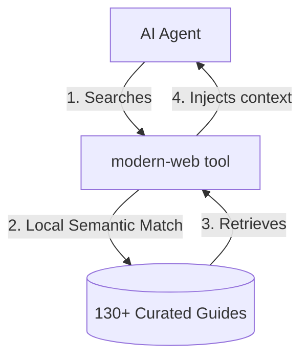
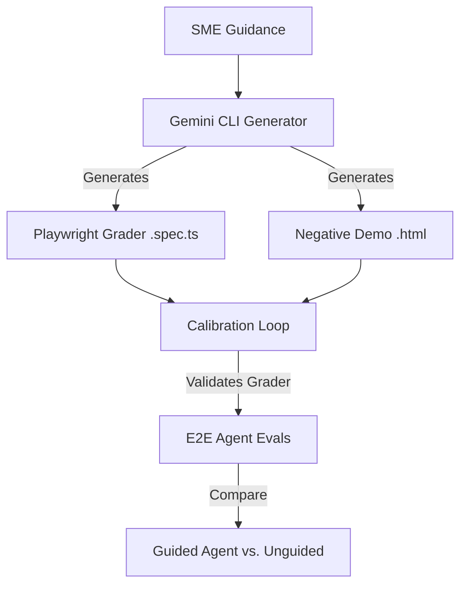

<p align="center">
  
</p>

# 🚀 Modern Web Guidance

Inject web platform expertise, best practices, and modern API patterns directly into your AI coding agents.

**Modern Web Guidance** is an agent skill (aka `SKILL.md`) that helps AI agents build better web applications using modern, high-performance, accessible, and secure APIs instead of legacy workarounds.

*Supported by the Google Chrome team, the Microsoft Edge team, and the web development community.*

(We build the project in the [modern-web-guidance-src](https://github.com/GoogleChrome/modern-web-guidance-src) repo.)

<!-- <LIKE A DEMO VIDEO LOOP OR SOMETHING?> -->

## ⚡ Quickstart

To start the interactive setup wizard:

```shell
npx modern-web-guidance@latest install
```

For alternative package managers and platforms, see [Alternative Installation Methods](#alternative-installation-methods) below.

### 🔍 Manual Search (Try without installing)

You can run the CLI directly to search and preview guides:

```shell
# Search for relevant guides
npx modern-web-guidance@latest search "animate a dialog modal backdrop"

# Retrieve a guide by ID
npx modern-web-guidance@latest retrieve "animate-to-from-top-layer"
```

## ❓ Why?

LLMs are trained on vast amounts of legacy code, causing AI coding agents to default to outdated patterns. They write bloated, custom JavaScript for tasks that now have native, high-performance web platform solutions.

Even if a model knows an API exists (**high recall**), it often lacks the density of real-world, modern implementation patterns required for production-ready code (**low coverage**).

**Modern Web Guidance bridges this gap.** We inject targeted, expert-curated guidelines directly into your agent's context window, focusing on:
* **Modern Browser APIs**: Helping models correctly structure APIs they frequently misuse.
* **Performance & Accessibility**: Eliminating legacy bloat with clean, native patterns.
* **Responsible Fallbacks**: Guiding models to use sensible, lightweight fallbacks instead of heavy polyfills.

## 📦 What's Included?

We cover the bleeding edge of the web platform and fallback strategies, focusing purely on what models struggle with. The guides are designed to be token-efficient—**no filler, just actionable guidance**.

### 🗂️ Core Disciplines

Here is a preview of our **134+ use-case-centric guides**:

| Category | Core Capabilities & APIs |
| :--- | :--- |
| **🎨 User Experience** | Smooth visual states (View Transitions, entry/exit animations, parallax scroll, CSS `scrollbar-color`). |
| **📐 CSS Layout** | Modern layout systems (container queries, `subgrid`, modern color spaces like `oklch`, text-wrap tuning, and line-height trimming). |
| **⚡ Performance** | Speed optimizations (instant preloading, Interaction to Next Paint (INP) diagnostics, and scheduling tasks via `scheduler.yield`). |
| **📝 Forms & UI** | Native components (Anchor Positioning for tooltips, Popover API, dialogs, `:user-invalid` validation, and auto-sizing fields). |
| **♿ Accessibility** | Hardened patterns (accessible error announcements, keyboard focus management). |
| **🤖 Built-in AI** | Local client models (native translation, summarization, and language detection APIs). |

<!-- INJECT_SKILL_COVERAGE -->

### 🛡️ Safe Adoption of Modern Features

* **Responsible Fallbacks**: We prioritize lightweight, case-specific custom fallbacks (<50 LOC) or conditionally-loaded polyfills instead of heavy third-party bundles.
* **Gotchas & Quirks**: We document hidden platform limitations, such as the 64KB payload quota for `fetchLater()` or macOS-specific scrollbar behaviors.
* **Baseline-Aware Integration**: We leverage real-time compatibility data from the Baseline project so agents can dynamically choose progressive enhancement over risky workarounds.

## ⚙️ How It Works

When your agent needs modern web APIs, it queries the local database:



1. **Discovery**: The agent is instructed to use the `modern-web` CLI for web platform queries.
2. **Local Semantic Search**: The agent runs `modern-web search "<query>"`. The tool matches the query to the best guide using an offline, CPU-efficient TensorFlow.js model (no network calls, no API keys).
3. **Context Injection**: The agent retrieves the guide via `modern-web retrieve <guide-id>`, inserting targeted code patterns, gotchas, and fallbacks directly into its context window.

## 💾 Alternative Installation Methods

<details>
<summary><b>Vercel Skills CLI</b></summary>

```shell
npx skills add GoogleChrome/modern-web-guidance
```
</details>

<details>
<summary><b>Google Antigravity</b></summary>

```shell
agy plugin install https://github.com/GoogleChrome/modern-web-guidance
```
</details>

<details>
<summary><b>GitHub CLI</b></summary>

```shell
gh skill install GoogleChrome/modern-web-guidance
```
</details>

<details>
<summary><b>GitHub Copilot CLI</b></summary>

```shell
/plugin marketplace add GoogleChrome/modern-web-guidance
/plugin install modern-web-guidance@googlechrome
```
</details>

<details>
<summary><b>Claude Code Plugin</b></summary>

```shell
/plugin marketplace add GoogleChrome/modern-web-guidance
/plugin install modern-web-guidance@googlechrome
/plugin  # Select GoogleChrome marketplace, press enter, enable AutoUpdate
/reload-plugins
```
</details>

## 🔄 Updating

If you installed the skill using `npx modern-web-guidance@latest install`, you can update with:

```sh
npx modern-web-guidance@latest update
```

Otherwise, consult your agent's documentation for updating plugins and skills.

## 🧪 Evaluation & Quality Assurance

Every guide in this pack is continuously calibrated to guarantee it helps agents write better code. We run automated evaluations using a closed-loop validation pipeline:



1. **Outcome-Based Assertions**: We write Playwright scripts (`.spec.ts`) that verify exact runtime behaviors, computed styles, and accessibility states.
2. **Self-Healing Calibration**: Graders are calibrated against both a reference implementation (100% pass target) and a flawed anti-pattern implementation (0% pass target). The generator automatically refines tests on failure.
3. **E2E Testing**: We measure agent performance on real tasks with and without guidance. We only publish guides that demonstrate a significant improvement in success rates (e.g., from 20% to 90%).

## 🗃️ Available Skill Packs

You can customize which skill packs are installed using the `--choose` flag:

```shell
npx modern-web-guidance@latest install --choose
```

* **`modern-web-guidance`** (~234 tokens): Comprehensive guidance on modern browser APIs, layouts, and performance.
* **`chrome-extensions`** (~181 tokens): Guidance on Manifest V3, background workers, extension APIs, and Chrome Web Store publishing.

## 📊 Telemetry & Privacy

Google collects anonymous usage statistics (such as search queries, guide retrievals, and installation) to improve the tool. You can inspect what is collected in [modern-web.ts](https://github.com/GoogleChrome/modern-web-guidance-src/blob/main/serving/bin/modern-web.ts).

> [!TIP]
> **To Opt-Out:**
> Set the `DISABLE_TELEMETRY=1` environment variable in your shell profile (e.g., `.bashrc` or `.zshrc`):
> ```bash
> export DISABLE_TELEMETRY=1
> ```

Google handles this data in accordance with the [Google Privacy Policy](https://policies.google.com/privacy).

## 👥 Contributors

Active contributors are what keep this project moving forward. Thanks to everyone who has contributed!

<a href="https://github.com/GoogleChrome/modern-web-guidance/graphs/contributors">
  
</a>

## 📄 Attribution

Portions of the documentation and compatibility data used in this project are derived from [MDN Web Docs](https://developer.mozilla.org/) by Mozilla Contributors, and [W3C](https://www.w3.org/) specifications.
